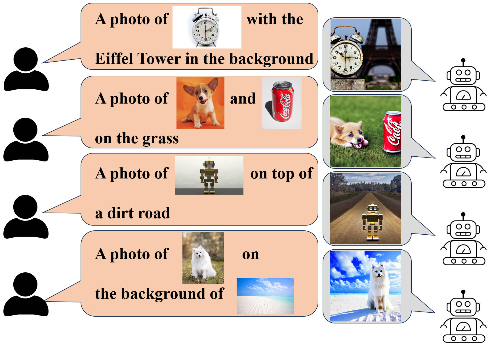
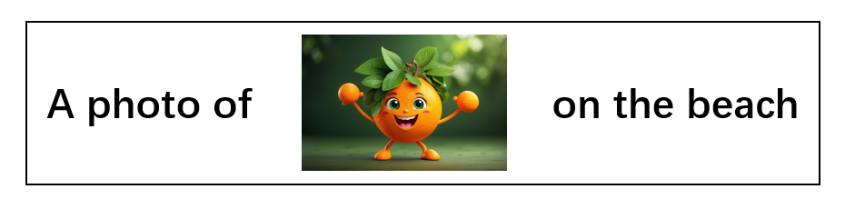
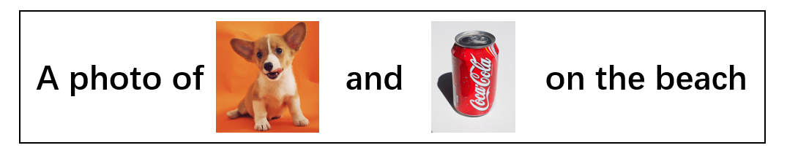

# Multi-Modal Prompt

Multi-Modal Prompt provides a user-friendly paradigm for customized generation. As the name suggests, it allows users to provide a prompt consisting of both textual and visual elements to create their own customized works.

### Results




### Getting Started

#### Setup

```
git clone https://github.com/zhongzero/multi-modal-prompt.git
cd multi-modal-prompt
conda create -n env-multi-modal-prompt python==3.8
conda activate env-multi-modal-prompt
pip install -r requirements.txt
```


#### Running

**example1:** 



we will try to generate customized images based on this multi-modal prompt through the command below

```
python src/main.py  --multi_modal_prompt "A photo of [img] on the beach" --img_paths "[examples/orange.jpg]"
```

`examples/orange.jpg` is the path of the image in the multi-modal prompt

the default directory of output images will be `output_imgs/`

**example2:** 



we will try to generate customized images based on this multi-modal prompt through the command below

```
python src/main.py  --multi_modal_prompt "A photo of [img] and [img] on the beach" --img_paths "[examples/orange.jpg, examples/can.jpg]"
```

`[examples/orange.jpg, examples/can.jpg]` are the paths of the images in the multi-modal prompt and they are specified by the order of appearance of images in the multi-modal prompt


**More Command Line Parameters ** 

| Command                   | Type | Example                                                 | Description                                                  |
| ------------------------- | ---- | ------------------------------------------------------- | ------------------------------------------------------------ |
| `--multi_modal_prompt`    | str  | `"A photo of [img] and [img] on the beach"`             | Multi-modal prompt.                                          |
| `--img_paths`             | str  | `"[examples/orange.jpg, examples/can.jpg]"`             | List of picture paths(in the order of appearance in the prompt) in the format of "[img1_path, img2_path, ...]". |
| `--method`                | str  | `"updated_dreambooth" or "updated_custom_diffusion"`    | *Optional* Defaults to `"updated_dreambooth"`. The based finetuning method we use in our paradigm. |
| `--output_model_dir`      | str  | `"pretrained_models"`                                   | *Optional* Defaults to ` "pretrained_models"`.  The output directory to store the fine-tuned model checkpoint and some intermediate outputs. |
| `--output_img_dir`        | str  | `"output_imgs"`                                         | *Optional* Defaults to ` "output_imgs"`.  The output directory to store the generated images. |
| `--output_result_path`    | str  | `"result.txt"`                                          | *Optional* Defaults to ` "result.txt"`.  The output file to store evaluation results. |
| `--pretrained_base_model` | str  | `"CompVis/stable-diffusion-v1-4"`                       | *Optional* Defaults to `"CompVis/stable-diffusion-v1-4"`. The pretrained base model used in our paradigm. |
| `--num_class_images`      | int  | `100`                                                   | *Optional* Defaults to `100`.  The number of images generated by pretrained_base_model for prior preservation loss. |
| `--generate_imgs_num`     | int  | `20`                                                    | *Optional* Defaults to `20`.   The number of images to generate. |
| `--gpt_api_key`           | str  | `"sk-RDzt6LOa3JctbuAAbtHkp7OxAaMjCUkkvZARlFBGg0pI5hhC"` | *Optional* Api key of openai gpt3.5. This project has provided a available api  key for test, and please don't use it for other purpose. |
| `--gpt_base_url`          | str  | `"https://api.chatanywhere.com.cn/v1"`                  | *Optional* Base url of openai gpt3.5.                        |

### Cite
```bibtex
@article{zhong2024user,
  title={User-Friendly Customized Generation with Multi-Modal Prompts},
  author={Zhong, Linhao and Hong, Yan and Chen, Wentao and Zhou, Binglin and Zhang, Yiyi and Zhang, Jianfu and Zhang, Liqing},
  journal={arXiv preprint arXiv:2405.16501},
  year={2024}
}
```
